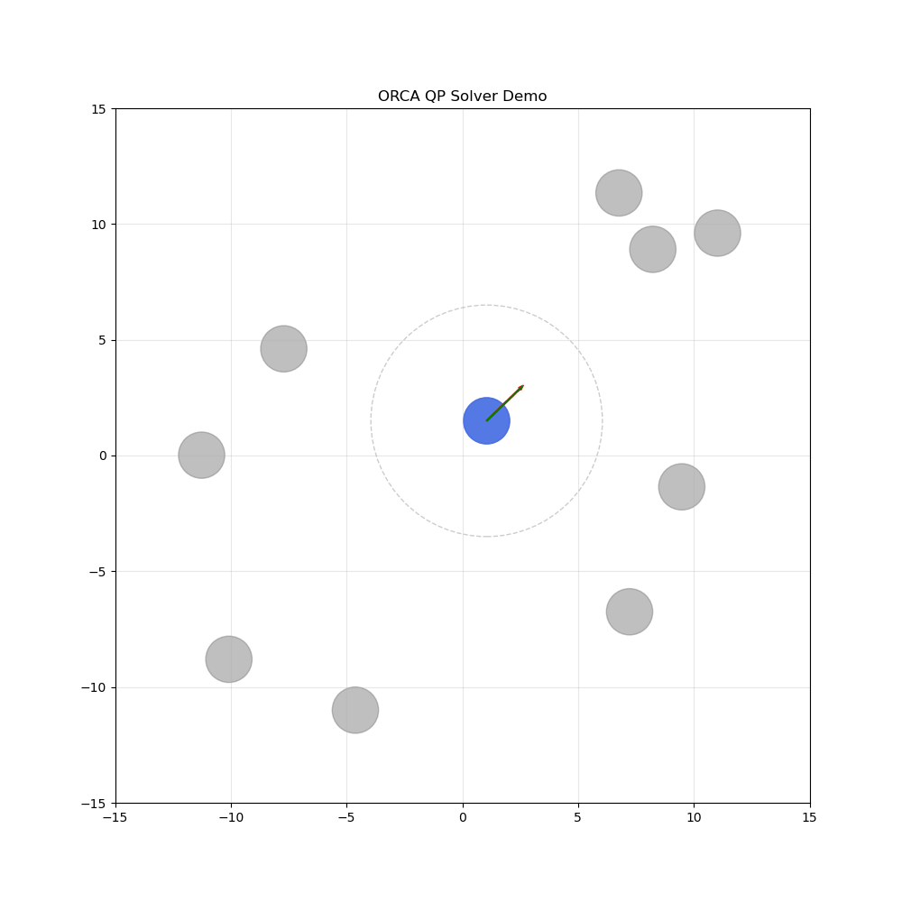

# Quadratic Programming Solver with Small ORCA Demo

During my Master’s at KTH I took DD2438 (Artificial Intelligence and Multi-Agent Systems) and we built drone/car AI agents in Unity. One subproject was about finding a path from A to B and following it in a complex environment where multiple agents acted as dynamic obstacles. That got me to revisit ORCA, and I wanted to learn more about Quadratic Programming, therefore I implemented a QP solver from scratch in Python for educational purposes

In this repo you’ll mainly find my re-implementation and study notes on Quadratic Programming (QP) and Interior-Point Methods (IPM). 

## Features
A implementation of a convex QP solver:
* Primal–Dual Interior-Point Method
* Mehrotra Predictor–Corrector
* Fraction-to-Boundary step rule
* Schur Complement reduction of the KKT system
* Dense solves via Cholesky / LU
* Full residual tracking & convergence report

A set of notes that explain:
* The QP formulation
* KKT conditions
* Primal-Dual Interior-Point Methods
* Mehrotra’s method (predictor + corrector)
* Complementarity and central path
* Schur complement normal equations

A simple simulation of Optimal Reciprocal Collision Avoidance using:
* Circular agents
* Point-to-point navigation
* Reciprocal velocity obstacles
* Real-time collision-free movement

This is not meant to be a high-performance ORCA implementation, but an educational one that demonstrates how ORCA constraints define half-planes in velocity space. The agents then choose a safe velocity heading toward their goals.

## Installation & Usage

```
git clone https://github.com/lazy-rZ/qp-Solver_.git
cd qp-Solver_
pip install -r requirements.txt
```

* The orca_demo.py visualizes agent using ORCA in action with QP-solver. You can toy with global parameters.
* The example_qp.py showcases the usage of QP solver.

## Demo


## References 
* Boyd & Vandenberghe - Convex Optimization
* Nocedal & Wright - Numerical Optimization
* Stephen Wright - Primal-Dual Interior-Point Methods
* Mehrotra (1992) - On the Implementation of a Primal-Dual Interior Point Method
* van den Berg et al. – Optimal Reciprocal Collision Avoidance (ORCA) / "Reciprocal n-body collision avoidance"

Recommneded to watch:
* Constrained Optimization: Intuition behind the Lagrangian from MATLAB
* Convex Optimization all three parts from Visually Explained

